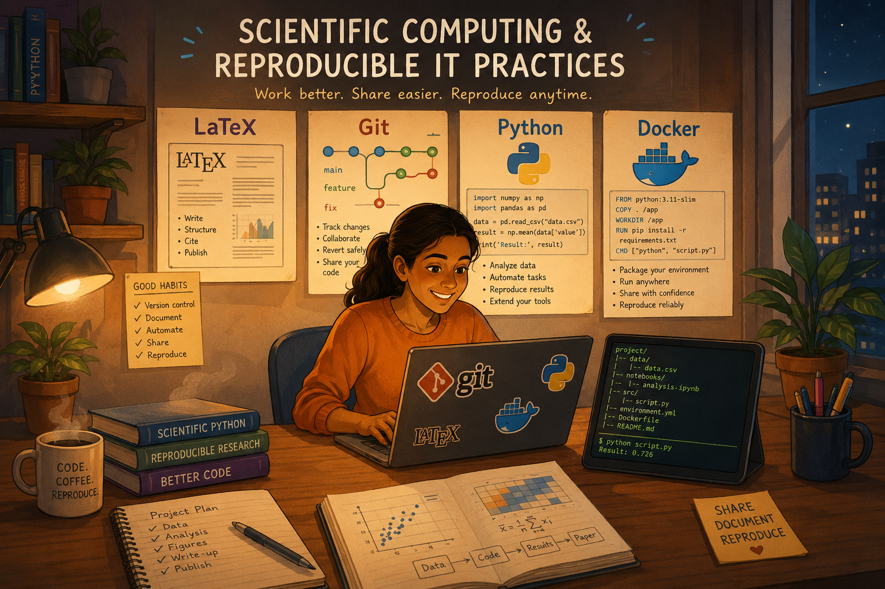

<section class="home-intro">
  

# Scientific Computing & Reproducible IT Practices

Course notes and practical tutorials for reproducible scientific computing.

Research projects get messy fast. This training path shows simple tools and habits that make your work easier to run, share, and reproduce.

We work with version control ([Git](https://git-scm.com/)), scientific scripting ([Python](https://www.python.org/)), containerization ([Docker](https://www.docker.com/)), and scholarly typesetting ([LaTeX](https://www.latex-project.org/)).

  <a class="home-action home-action--primary" href="introduction/">Recommended workflow</a>
  <a class="home-action" href="blocks/">Browse blocks</a>

  

  <figure class="home-intro__figure">
    
    <figcaption><i>

This illustration was generated by IA.

</i></figcaption>
  </figure>
</section>

## Why this tutorial?

We’re not training software engineers. The goal is to help PhD students:

- Save time by keeping environments and folders consistent.
- Track changes in code and writing.
- Collaborate with clear reviews and manageable changes.
- Reuse setups, automate routine tasks, and speed up the path to publication.

You’ll leave with a small toolkit and a workflow you can reuse throughout your PhD and after.

This training is organized by the [SIE Doctoral School](https://www.univ-smb.fr/edsie/) at [Université Savoie Mont Blanc (USMB)](https://www.univ-smb.fr/).
