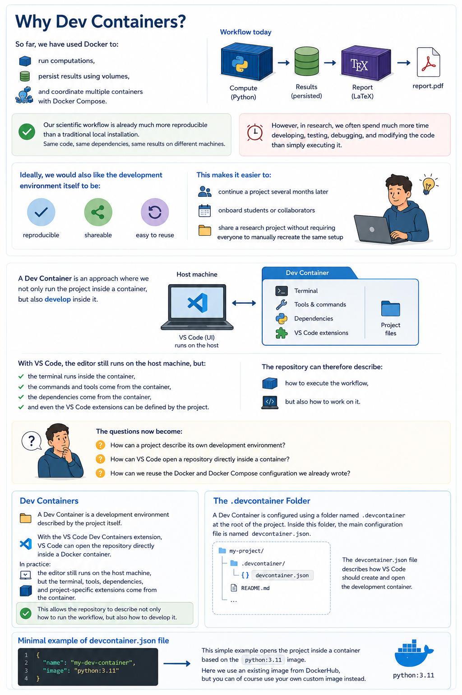

## Official documentation

- [Dev Containers](https://code.visualstudio.com/docs/devcontainers/containers), official documentation for the VS Code Dev Containers extension.
- [Advanced Dev Containers](https://code.visualstudio.com/remote/advancedcontainers/overview), cover advanced container configuration when working with the VS Code Dev Containers extension.
- [Dev Container metadata reference](https://containers.dev/implementors/json_reference/), list of all possible metadata fields and their types and examples.

## Why Dev Containers?


*This illustration was generated by IA.*
<!-- So far, we have used **Docker** to:

* run computations,
* persist results using volumes,
* and coordinate multiple containers with **Docker Compose**.

At this point, our scientific workflow is already much more reproducible than a traditional local installation.
This is already useful:
we can run the same code, with the same dependencies, and obtain the same results on different machines.

**However, in research, we often spend much more time developing, testing, debugging, and modifying the code than simply executing it.**

Ideally, we would also like the development environment itself to be:
- reproducible,
- shareable,
- and easy to reuse.

This makes it easier to:
- continue a project several months later,
- onboard students or collaborators,
- or share a research project without requiring everyone to manually recreate the same setup.

A **Dev Container** is an approach where we not only run the project inside a container, but also develop inside it.

With VS Code, the editor still runs on the host machine, but:

* the terminal runs inside the container,
* the commands and tools come from the container,
* the dependencies come from the container,
* and even the VS Code extensions can be defined by the project.

The repository can therefore describe:

* how to execute the workflow,
* but also how to work on it.

The questions now become:

* **How can a project describe its own development environment?**
* **How can VS Code open a repository directly inside a container?**
* **How can we reuse the Docker and Docker Compose configuration we already wrote?** -->


## Dev Containers

A Dev Container is a development environment described by the project itself.

With the VS Code Dev Containers extension, VS Code can open the repository directly inside a Docker container.

In practice:
- the editor still runs on the host machine,
- but the terminal, tools, dependencies, and project-specific extensions come from the container.

This allows the repository to describe not only how to run the workflow, but also how to develop it.


## The `.devcontainer` Folder

A Dev Container is configured using a folder named `.devcontainer` at the root of the project.
Inside this folder, the main configuration file is named `devcontainer.json`.

The `devcontainer.json` file describes how VS Code should create and open the development container.

### Minimal example of `devcontainer.json` file: 
```json
{
  "name": "my-dev-container",
  "image": "python:3.11"
}
```
This simple example opens the project inside a container based on the `python:3.11` image.
Here we use an existing image from DockerHub, but you can of course use your own custom image instead.

You can open the project inside the Dev Container from VS Code:

- Open the Command Palette (F1)
- Type "Dev Containers: Reopen in Container"


<details>

### Using an Existing Dockerfile or compose.yml

If the project already contains a `Dockerfile`, the Dev Container can reuse it directly.

- Dockerfile:

```json
{
  "name": "my-dev-container",
  "build": {
    "dockerfile": "../Dockerfile",
    "context": ".."
  },
}
```
- Docker compose:

```json
{
  "dockerComposeFile": [
    "../compose.yml",
    "compose.extend.yml"      // Overriding default compose.yml if need
  ],
  "service": "<service_name>", // Service used as the development container
    "runServices": [          // Services started when opening the Dev Container
    "<service_name>"
  ],
  "workspaceFolder": "/app",
  "shutdownAction": "stopCompose"
}
```

</details>

After opening the project in the Dev Container, the VS Code terminal runs directly inside `/app`.
Commands such as:

```bash
python src/compute.py
```
will be executed directly inside `/app`.


## Exercise

1. Create a `.devcontainer` folder at the root of the project repository.
2. Create a `.devcontainer/devcontainer.json` file.
3. Configure it to reuse either the existing `Docker Image`.
4. Open the project with `Dev Containers: Reopen in Container`.
5. In the VS Code terminal, run:

```bash
python src/compute.py
```

6. Check that the results are created from inside the container.
7. Close and reopen the project to verify that the development environment can be recreated.
8. Try to add some customizations to your Dev Container such as VS Code extensions, you can find some hints [here](https://code.visualstudio.com/docs/devcontainers/create-dev-container#_create-a-devcontainerjson-file).
9. Add a `postCreateCommand` in order to install [pre-commit](https://pre-commit.com/)
10. Add a `postStartCommand` in order to run the generation of your python figure.
11. Configure your Dev Container to use your existing `compose.yml` and access to `compute` service.
See [Using an Existing Dockerfile or compose.yml](#using-an-existing-dockerfile-or-composeyml) to help you.
12. Configure your Dev Container to connect to `report` service of your `compose.yml` 


## Conclusion

A Dev Container makes the development environment part of the project.

Docker allows us to run workflows in a reproducible way.
Docker Compose allows us to coordinate several containers.
Dev Containers allow us to develop inside the same kind of reproducible environment.

For research projects, this is a practical way to share not only the code, but also the environment used to develop it.

## Going Further

In this course, we mostly reused our own Docker images and Compose configuration in order to better understand how Dev Containers interact with Docker itself.

In practice, many developers instead start from preconfigured Dev Container images provided by Microsoft:

```json
{
  "image": "mcr.microsoft.com/devcontainers/python:3.11"
}
```

These images already contain:

- a non-root user configured for development,
- common command line utilities,
- VS Code integration tools,
- and many quality-of-life configurations.

This is particularly useful on Linux systems where file permissions and user IDs can become problematic when developing as root inside containers.

On macOS and Windows, Docker Desktop hides part of these permission issues, so they are often less visible during development.

In practice, a common workflow is therefore:

- start from an official Dev Container image,

- then customize it for the needs of the project.
