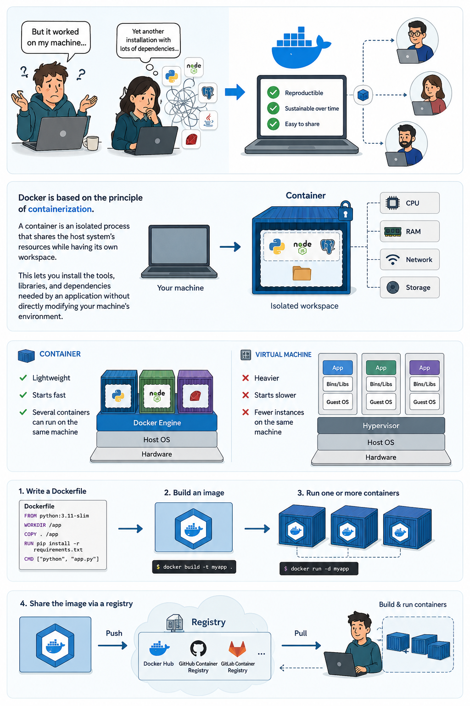

## Why Use Docker?

*This illustration was generated by IA.*
<!-- - "But it worked on my machine..."
- "Yet another installation with lots of dependencies..."

Docker addresses these problems by creating work environments that are reproducible, sustainable over time, and easy to share with colleagues.

Docker is based on the principle of containerization.
A container is an isolated process that shares the host system's resources while having its own workspace.
This lets you install the tools, libraries, and dependencies needed by an application without directly modifying your machine's environment.

Unlike a virtual machine, where a full operating system is emulated, a container is much lighter and starts faster.
It then becomes possible to run several containers on the same machine, each associated with a different application or service.

To create a container with Docker, you first define a configuration file called a `Dockerfile`.
The `Dockerfile` contains all the instructions needed to build a Docker image: selecting the base image, installing dependencies, copying project files, and defining the command to run at startup.
A Docker image is **immutable**: if the environment changes, a new image is rebuilt instead of modifying the existing one.

Once this image has been built, it can be used to launch one or more identical containers.
This mechanism guarantees that a project works the same way on several machines, provided that Docker is installed on them.
The resulting image can also be distributed and used by other users to build their own containers.
Platforms that host Docker images are called `registries`: *DockerHub*, *GitHub Container Registry*, *Gitlab Container Registry*, etc. -->

## Prerequisites

### Hardware ressources

Using Docker can be resource-intensive, in terms of both disk space and RAM. Please ensure you have at least:
- 64-bit processor
- 8 GB of RAM
- 20 GB of free disk space
- Enable hardware virtualization in BIOS/UEFI. For more information, see [Virtualization](https://docs.docker.com/desktop/troubleshoot-and-support/troubleshoot/topics/#docker-desktop-fails-due-to-virtualization-not-working)

### Software to install

We do not provide computers. You must bring a working computer on which you can install software. This training requires several software tools to be installed on your machine, listed below.

- Visual Studio Code
- Git
- Docker Desktop

You can find all the prerequisites needed to follow this training in the [Docker course landing page](../#installation-instructions).

### VSCode extensions

- Container Tools [here](https://marketplace.visualstudio.com/items?itemName=ms-azuretools.vscode-containers), used to manage your containers directly from VSCode.
- Dev Containers [here](https://marketplace.visualstudio.com/items?itemName=ms-vscode-remote.remote-containers), used to benefit from the DevContainer experience.

## Training Organization

### Outline 
- Round-table introduction
- Phase 1: [Create my first container with Docker](../01-first-container/)
- Phase 2: [Volumes and persistence](../02-volumes-and-persistence/)
- Phase 3: [Docker Compose](../03-docker-compose/)
- Phase 4: [Dev Container](../04-dev-container/)

### Challenge 
Our objective will be to build a reproducible scientific pipeline:

- Python computation
- Figure / data generation
- LaTeX compilation
- Shared environment

The work repository is available [here](https://github.com/SCRIPT-SIE-2026/BLOCK4_Docker_Project.git).
You can pull this repository to work on it throughout this session.
Some answers are available in the repository’s branches. Naturally, we’re counting on you to play along and try to find them yourself or with the other learners first.

Our final objective will be to obtain a fully reproducible scientific development environment:
same tools, same dependencies, same editor configuration, and same workflow on every machine.

## Resources and Extras

- A sheet listing the main Docker commands used is available [here](../cheatsheets/docker-commands/).
- A sheet listing the main Docker Compose commands used is available [here](../cheatsheets/docker-compose-commands/).
- A short note about using `make` to simplify Docker workflows is available [here](../utils/make-and-docker/).

