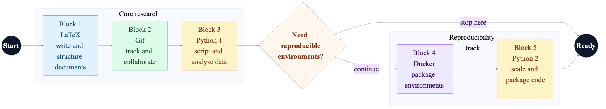

These workshops help PhD students build a simple, repeatable research workflow. You can follow the full sequence or pick only the modules you need.

We cover:

- LaTeX for writing
- Git for version control
- Python for scripting and analysis
- Docker for running projects the same way on any machine

## Recommended sequence

- Block 1: [LaTeX](/blocks/block1-latex/)
- Block 2: [Git](/blocks/block2-git/)
- Block 3: [Python 1/2](/blocks/block3-python-intro/)
- Block 4: [Docker](/blocks/block4-docker/)
- Block 5: [Python 2/2](/blocks/block5-python-advanced/)

You can enroll in any subset. This order works well because Python 2/2 assumes you’ve seen Python 1/2.

## Pathways

You can:

- Take only the sessions you need right now
- Do the full sequence for a complete toolkit
- Go step by step at your own pace

## Intended audience

This series is for doctoral candidates who:

- Are new to research computing tools
- Want good habits early in the PhD
- Want smoother writing, coding, collaboration, and reproducibility

## Format and requirements

- Format: Hands-on workshops with research-friendly examples
- Level: Introductory (no prior experience required)
- Requirements: A laptop with admin install permissions (Windows, macOS, or Linux). We’ll guide the setup during the sessions.

Not sure where to start? Contact {} {} and we’ll help you pick a path that fits your needs.

<!--more-->
